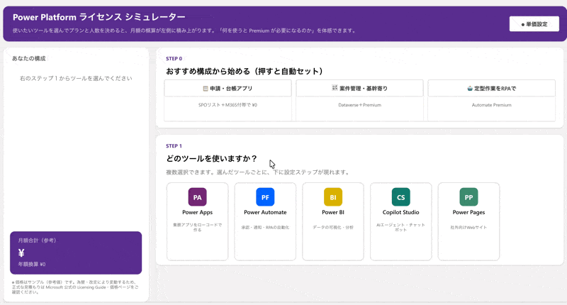

# Power Platform ライセンス シミュレーター

Power Platform のライセンス体系を「触って体感する」ためのキャンバスアプリです。
使いたいツール（Power Apps / Power Automate / Power BI / Copilot Studio / Power Pages）を選んで、プランと人数を決めていくと、月額の概算が左ペインに積み上がります。

**「何を使うと Premium ライセンスが必要になるのか」** を、社内説明やコミュニティのデモでサクッと見せるためのアプリです。

## 📸 デモ



## ⚠️ 最初に必ず読んでください（免責）

- **このアプリに表示される金額はサンプル（参考値）です。実際の価格とは異なる可能性があります。**
- 価格は為替や改定で頻繁に変わります。正式な見積もりには絶対に使わないでください
- あくまで **「ライセンスの構造はこうなっているんだよ」「こういうアプリが作れるんだよ」というイメージを掴むためのデモ** としてお使いください
- 正式な情報は Microsoft 公式の [Power Platform Licensing Guide](https://go.microsoft.com/fwlink/?linkid=2085130) および各製品の価格ページを参照してください

## 📝 関連記事

このアプリは、企画段階で「企画＋動く画面＋技術メモ」を1枚のHTMLにまとめ、
そのHTMLをClaude Codeに読ませてCanvas App化する、という流れで作りました。
作り方の詳細はこちら：

▶ [Power Apps の企画書を「動く HTML 1枚」にしてみたら良かった話 - Qiita](https://qiita.com/kama_bizdev/items/b1d8a5d267da860dfc7d)

## ✨ できること

- **おすすめ構成プリセット**: 「申請・台帳アプリ（¥0）」「案件管理・基幹寄り」「定型作業をRPAで」の3つから、前提知識ゼロでも構成を体感できる入口
- **ツール複数選択 → ツールごとの設定ステップが出現**
- **Premium 強制ロジック**: Power Apps で Dataverse / マップ / AI Builder / プレミアムコネクタのどれかを選ぶと、M365 付帯プランがロックされて自動で Premium に切り替わる（このアプリの教育ポイントの核）
- **SharePoint リスト vs Dataverse の比較表**（追加コスト・権限管理・データ量・リレーション・用途の5軸）
- **Power BI**: 「共有した瞬間に Pro 以上が必要」を体感
- **Power Automate**: Process プラン選択で数量単位が「人」→「ボット」に切替
- **アドオン**: Dataverse 追加容量、Copilot Credits（AI Builder クレジットは 2026/11 以降 Copilot Credits に統合予定のため一本化。「ライセンス＝入場券、Credits＝燃料」の二層構造で説明）
- **⚙ 単価設定パネル**: 画面上で単価を書き換えると全体に即時反映（セッション内のみ有効）

## 🆓 このアプリ自体が「無償ライセンスの範囲」で動きます

このアプリのコンセプトは **「ライセンス説明アプリ自身が、追加ライセンス不要で動くこと」** です。

- **データソース・コネクタ: 一切なし**（Dataverse も SharePoint も使っていません）
- 単価データはすべて **アプリ内のコレクション** に持っています
- プレミアムコネクタ・PCF コードコンポーネント不使用

## 📦 インポート方法

1. このリポジトリの `.msapp` ファイルをダウンロード
2. [make.powerapps.com](https://make.powerapps.com) → 左メニュー「アプリ」→「アプリのインポート」（または「新しいアプリ」→ キャンバス → 「開く」から .msapp を指定）
3. 開いたら「名前を付けて保存」して自分の環境に保存
4. タブレット（横）レイアウトのアプリです。共有する場合はそのまま「共有」から

## 💴 単価の書き換え方（重要）

データソースを持たない設計のため、**単価はアプリ内に直書きされています。単価に合わせて書き換えてから使ってください。**

### 方法1: アプリ実行中に変える（一時的）
ヘッダーの「⚙ 単価設定」ボタンから全9項目を編集できます。**アプリを閉じると既定値に戻ります**。デモ中にサッと変えたいときはこちら。

### 方法2: 恒久的に変える（推奨）
Power Apps Studio でアプリを開き、以下の **2か所** の `ClearCollect(colPrices, ...)` 内の `price` の値を書き換えて保存・公開してください。

| 場所 | プロパティ |
|---|---|
| `Screen1` | `OnVisible`（起動時の初期値） |
| `btnPpReset`（単価設定パネル内「既定値に戻す」ボタン） | `OnSelect`（リセット時の値） |

```
ClearCollect(colPrices,
  {key:"appsPremium",   label:"Power Apps Premium（/人/月）",        price:2998},
  {key:"autoPremium",   label:"Power Automate Premium（/人/月）",    price:2248},
  {key:"autoProcess",   label:"Power Automate Process（/ボット/月）", price:22488},
  {key:"biPro",         label:"Power BI Pro（/人/月）",              price:2098},
  {key:"biPpu",         label:"Power BI PPU（/人/月）",              price:3598},
  {key:"copilotPack",   label:"Copilot Studio（/25,000msg/月）",     price:29985},
  {key:"pagesPack",     label:"Power Pages（/100人パック/月）",       price:29985},
  {key:"dataverseGb",   label:"Dataverse 追加容量（/GB/月）",         price:5997},
  {key:"copilotCredits",label:"Copilot Credits（/パック/月）",        price:74963}
)
```

`price` の数値だけ変えれば OK です（`key` は明細計算が参照しているので変えないでください）。

## 🏗 設計メモ（中身に興味がある人向け）

- **状態管理**: 構成全体を 1 つのレコード型変数 `varConfig` に集約（選択ツール・プラン・数量など全部入り）。変数の乱立なし
- **明細と合計**: 明細ギャラリの `Items` に `With` + `Filter(Table(...), show)` で全パターンの行を宣言的に定義。合計は `Sum(galSummary.AllItems, v)`
- **Premium 強制**: 各選択の `OnSelect` 末尾で条件判定して `appsPlan` を `"premium"` に Patch。M365 付帯カードはロック表示＋理由文を表示
- **カード UI**: ギャラリ＋テンプレート内の透明な全面ボタン（最前面）でどこを押しても反応する
- 1 画面構成・委任警告ゼロ（そもそもデータソースがない）

## 📁 リポジトリ構成

```
├── README.md
├── LICENSE
├── KansuDentaku.msapp       ← インポート用パッケージ
└── images/
    └── demo.gif             ← デモ GIF
```

## ライセンス

[MIT License](LICENSE)

---

*価格・プラン体系は作成時点（2026年6月）の情報を元にしたサンプルです。最新かつ正確な情報は必ず Microsoft 公式情報をご確認ください。*
